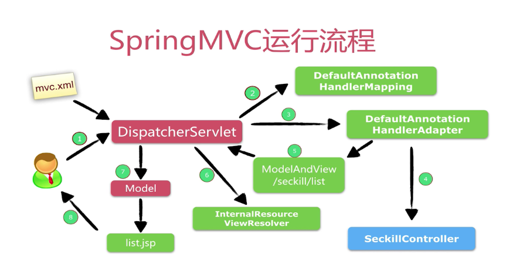
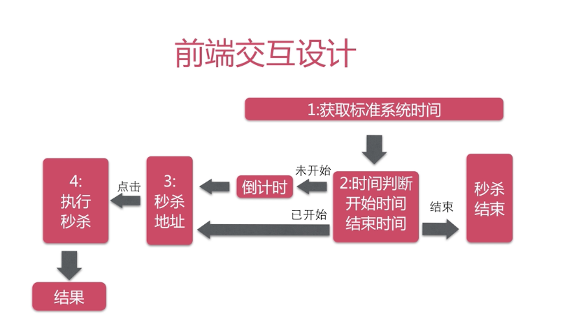
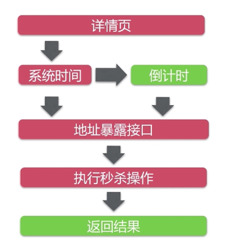
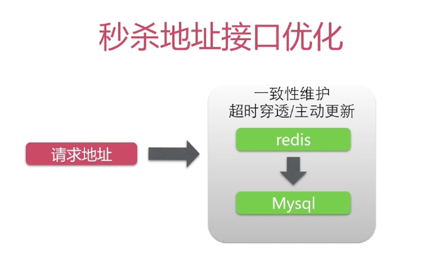

# 相关设计介绍

## 秒杀API的URL设计

```
GET     /seckill/list                   秒杀列表
GET     /seckill/{id}/detail            详情页
GET     /seckill/time/now               系统时间
POST    /seckill/{id}/exposer           暴露秒杀
POST    /seckill/{id}/{md5}/execution   执行秒杀
```

## spring mvc 运行流程




## 注解映射技巧

@RequestMapping注解：

1. 支持标准的URL,
2. Ant风格URL,(即?和*和**等字符)
3. 带{XXX}占位符的URL


例如：

- /user/*/creation    匹配 /user/aaa/creation、 /user/bbb/creation等URL
- /user/**/creation   匹配 /user/creation、 /user/aaa/bbb/creation等URL
- /user/{userId}      匹配 /user/123、 /user/abc等URL

## 前端交互设计



## 高并发优化

下图秒杀流程中红色表示可能出现高并发的问题，绿色表示没有影响



### 为什么要单独获取系统时间？

在没有开始秒杀时用户会大量刷新页面，

cdn的理解

- CND(内容分发网络)加速用户获取数据的系统
- 部署在离用户最近的网络节点上
- 命中CDN不需要访问后端服务器
- 互联网公司自己搭建或租用

**获取系统时间不用优化**，java访问一次内存（Cacheline）大约10ns


### 秒杀地址接口分析

- 无法使用CDN缓存
- 适合服务端缓存：redis等
- 一致性维护成本低

**秒杀地址接口优化**




### 秒杀操作优化分析

- 无法使用CDN缓存
- 后端缓存困难：库存问题
- 一行数据竞争：热点商品